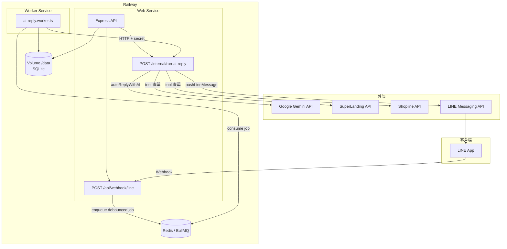

# 02 — 系統架構

## Mermaid：部署與訊息流

## 主站 vs Worker

| 元件 | 執行位置 | 職責 |
|------|----------|------|
| **Web** | `server/index.ts` → bundle `dist/index.cjs` | 路由、Webhook、SSE、排程（訂單同步、idle close 等）、**enqueue** AI job |
| **Worker** | `server/workers/ai-reply.worker.ts` | **只**消費 `ai-reply` queue、合併 pending、冪等 delivery、呼叫 internal API |

## 訊息流（LINE 文字，Redis 模式）

1. **LINE webhook** → 驗簽、對渠道 → `messages` INSERT user  
2. **`enqueueDebouncedAiReply`** → Redis list `ai-reply:pending:line:{contactId}` + BullMQ **delayed** job（固定 `jobId`）  
3. **Worker** `consumePendingMessages` → 合併文字 → `ai_reply_deliveries` 冪等  
4. **`POST /internal/run-ai-reply`** → `autoReplyWithAI` → Gemini / tools  
5. **`pushLineMessage`** → LINE API → 客人收到；`messages` INSERT ai  

## DB Schema 重要表（摘要）

| 表 | 用途 |
|----|------|
| **brands** | 品牌名稱、slug、**system_prompt**、一頁/Shopline 憑證、**return_form_url** |
| **channels** | 每品牌 LINE/Messenger：**bot_id**（對 LINE destination）、**access_token**、**channel_secret**、**is_ai_enabled** |
| **contacts** | 對話主體：platform、**platform_user_id**、**brand_id**、**channel_id**、status、needs_human、tags… |
| **messages** | 對話內容：sender_type user/ai/admin/system、content、message_type |
| **ai_logs** | 每輪 AI 決策摘要：tools_called、reply_source、plan_mode、token_usage… |
| **orders_normalized** | 訂單索引快取（**brand_id** + **source** + global_order_id）；供本地查單 |
| **order_items_normalized** | 訂單明細索引 |
| **product_catalog** | 品牌商品目錄（導購／工具） |
| **knowledge_files** | 品牌知識檔（content、category、intent…） |
| **settings** | 鍵值設定：**gemini_api_key**、**openai_api_key**、**test_mode**、idle_close_hours… |
| **ai_reply_deliveries** | Worker 批次送出的 **delivery_key** 冪等紀錄 |
| **system_alerts** | 告警：auto_reply_blocked、transfer、webhook_sig_fail… |

完整 DDL 見 **`09a-database-db.ts.md`**；型別見 **`09b-database-schema.ts.md`**。
